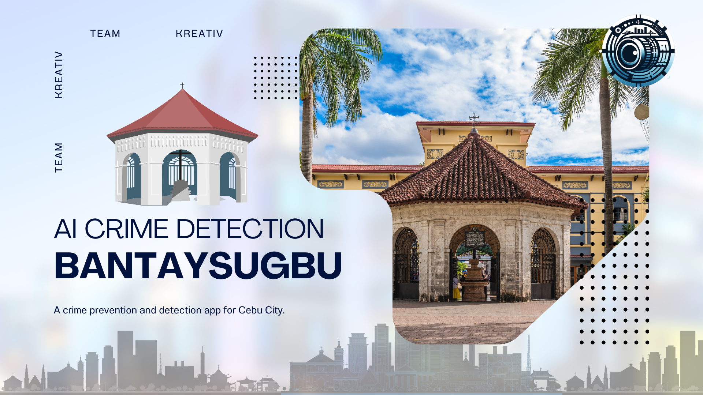

<p align="center">
  <a href="" rel="noopener">
 </a>
</p>
<h3 align="center">BantaySugbu <br> A Crime Prevention and Detection App for Cebu City</h3>

<div align="center">

[]()
[](https://github.com/dnachavez/BantaySugbu-2024-Cebu-Interschool-Hackathon-Entry/issues)
[](https://github.com/dnachavez/BantaySugbu-2024-Cebu-Interschool-Hackathon-Entry/pulls)
[](LICENSE)

</div>

---

<p align="center"> Our hackathon entry during the 2024 Cebu Interschool Hackathon by CIB.O last June 7, 2024 at Community Hall, 9th Floor, Cebu City Hall, Executive Building.
    <br> 
</p>

## 📝 Table of Contents

- [Problem Statement](#problem_statement)
- [Idea / Solution](#idea)
- [Dependencies / Limitations](#limitations)
- [Future Scope](#future_scope)
- [Setting up a local environment](#getting_started)
- [Usage](#usage)
- [Technology Stack](#tech_stack)
- [Authors](#authors)
- [Acknowledgments](#acknowledgments)

## 🧐 Problem Statement <a name = "problem_statement"></a>

### Hackathon Challenge Theme: Smart City Initiatives: Harnessing AI to Tackle Urban Challenges

**Challenges Options:**
1. Traffic Management: Solutions for improved traffic flow, real-time monitoring, or efficient public transportation.
2. Water Management: Innovations for water conservation, efficient distribution, water quality monitoring, or tackling water scarcity.
3. Waste Management: Applications to enhance waste collection, and recycling processes, or reduce plastic usage.
4. Flood Management: Design tools for flood prediction, early warning systems, or better drainage management.
5. Public Health: Develop platforms for improving healthcare access, managing disease outbreaks, or health education.
6. Education Access: Innovate solutions to improve access to education, online learning platforms, or educational resources for underserved communities.
7. Economic Development: Create applications to support local businesses, tourism, or job creation.
8. ``Safety and Security: Develop tools for crime prevention, emergency response, or community safety monitoring.``
9. Environmental Sustainability: Design solutions for pollution monitoring, green space management, or promoting sustainable practices.
10. Housing and Infrastructure: Create applications to address housing shortages, improve urban planning, or monitor infrastructure health.
11. Community Engagement: Develop platforms to increase citizen participation in local governance, community projects, or public consultations.

## 💡 Idea / Solution <a name = "idea"></a>

BantaySugbu is a crime prevention and detection app designed specifically for Cebu City. The idea behind this app is to leverage technology, specifically AI, to enhance safety and security in the city. The app aims to provide tools for crime prevention, emergency response, and community safety monitoring.

With BantaySugbu, users will have access to real-time crime history and heat map, allowing them to stay informed about incidents happening in their vicinity. The app also reports detected crime to nearest emergency response to easily notify authorities about any suspicious activities or emergencies.

By harnessing the power of AI and technology, BantaySugbu aims to create a safer and more secure environment for the residents of Cebu City. It is a comprehensive solution that addresses the need for effective crime prevention, and emergency response in the context of a smart city initiative.


## ⛓️ Dependencies / Limitations <a name = "limitations"></a>

### Dependencies:
- Python 3.11.9 or higher
- Flask 2.3.2 or higher
- PyTorch 2.0.1 or higher
- Transformers 4.30.2 or higher
- Pillow 9.4.0 or higher
- PythonDotENV 1.0.0 or higher

### Limitations:
1. Limited Data Accuracy: The accuracy of crime data depends on the availability and reliability of reported incidents, including datasets the model has been trained on. Incomplete or inaccurate reporting can lead to discrepancies in the crime history and heat map provided by the app.

2. Network Connectivity: BantaySugbu relies on a stable internet connection to fetch real-time crime data and communicate with emergency response services. Poor network connectivity can affect the app's performance and responsiveness.

3. Privacy Concerns: BantaySugbu collects and stores data, including location information, to provide personalized crime alerts and improve the app's functionality. However, privacy concerns may arise regarding the collection and usage of data.

4. Technical Limitations: The current version of BantaySugbu may have technical limitations in terms of scalability, performance, and compatibility with different devices and operating systems. These limitations may impact the app's usability and user experience.

### Explanation:
1. The limitation of limited data accuracy exists because the app relies on reported incidents, and if incidents are not reported or inaccurately reported, it can affect the accuracy of the crime data.

2. The limitation of network connectivity exists because the app requires a stable internet connection to fetch real-time crime data and communicate with emergency response services. Poor network connectivity can hinder these functionalities.

3. The limitation of privacy concerns exists because the app collects and stores data, including location information, which may raise privacy concerns.

4. The limitation of technical limitations exists because the current version of the app may have scalability, performance, and compatibility limitations. These limitations can affect the app's usability and user experience.

### Impact and Further Research:
- The limited data accuracy can impact the reliability of crime insights and may require further research on improving incident reporting mechanisms and data verification processes.
- The network connectivity limitation highlights the need for robust offline capabilities and alternative communication channels in case of poor internet connectivity.
- The privacy concerns call for transparent data handling practices and privacy-enhancing features to address user concerns.
- The technical limitations indicate the need for continuous development and optimization to improve scalability, performance, and compatibility with different devices and operating systems.


## 🚀 Future Scope <a name = "future_scope"></a>

## 🚧 What We Could Not Develop During the Hackathon

During the course of the Hackathon, one aspect of our project that we were unable to develop was the SMS notification feature. This feature would have allowed the app to send alerts to the nearest emergency response team whenever a crime was detected. Unfortunately, due to limited access to an SMS API and time constraints, we were unable to implement this functionality.

## 🌟 Future Potential of Our Project

Looking ahead, our project has great potential for further development and expansion. With continued work and resources, we envision the following achievements:

1. **Enhanced Crime Prevention:** By leveraging AI and technology, our app can continue to improve crime prevention measures. This includes developing advanced algorithms to detect suspicious activities and provide real-time alerts.

2. **Expanded Emergency Response Integration:** In the future, we aim to integrate our app with emergency response services, enabling seamless communication and coordination between users and authorities. This would enhance the effectiveness and efficiency of emergency response efforts.

3. **Community Engagement and Collaboration:** We plan to incorporate features that promote community engagement and collaboration. This could involve creating platforms for citizens to report incidents, share safety tips, and participate in neighborhood watch programs.

4. **Data Analysis and Insights:** By analyzing crime data collected through the app, we can gain valuable insights into crime patterns and trends. This information can be used to develop targeted strategies for crime prevention and resource allocation.

5. **Partnerships and Integration:** We aspire to establish partnerships with local law enforcement agencies, government bodies, and community organizations. This collaboration would enable us to access additional resources, data, and expertise to further enhance the effectiveness of our app.

Overall, our project has the potential to make a significant impact on safety and security in Cebu City. With continuous development and support, we aim to create a comprehensive crime prevention and detection solution that contributes to building a safer and more secure environment for all residents.

## 🏁 Getting Started <a name = "getting_started"></a>

These instructions will get you a copy of the project up and running on your local machine for development
and testing purposes. See [deployment](#deployment) for notes on how to deploy the project on a live system.

### Prerequisites

This project requires the following libraries:

- Python 3.6 or higher
- PyTorch
- Transformers
- Flask
- Pillow
- python-dotenv

You can install these prerequisites using pip, Python's package installer.

### Installing

Here's a step-by-step guide on how to get a development environment running:

1. Clone the repository to your local machine using git clone.

```
git clone https://github.com/dnachavez/BantaySugbu-2024-Cebu-Interschool-Hackathon-Entry.git
```

2. Navigate to the project directory.

```
cd BantaySugbu-2024-Cebu-Interschool-Hackathon-Entry
```

3. Install the required Python packages.

```
pip install torch transformers flask Pillow python-dotenv
```

4. Load the pretrained model and processor. Make sure the model is located in the project directory and the path is correctly specified in the MODEL_PATH variable in app.py. You can download the model [here](https://dnachavez.dev/projects/bantaysugbu/model.zip)

5. Run the Flask application.

## 🎈 Usage <a name="usage"></a>

Once you have the application running, you can interact with it through the web interface

**Web Interface**

Open your web browser and navigate to http://127.0.0.1:5000. Here, you'll find the user interface for the application. Follow the instructions on the page to use the application.

## ⛏️ Built With <a name = "tech_stack"></a>

- [Python](https://www.python.org/) - Programming Language
- [PyTorch](https://pytorch.org/) - Machine Learning Library
- [Transformers](https://huggingface.co/transformers/) - State-of-the-art Natural Language Processing
- [Flask](https://flask.palletsprojects.com/) - Web Framework
- [Pillow](https://pillow.readthedocs.io/en/stable/) - Python Imaging Library
- [python-dotenv](https://pypi.org/project/python-dotenv/) - Python module that allows you to specify environment variables in traditional UNIX-like ".env" files.

## ✍️ Authors <a name = "authors"></a>

- [@dnachavez](https://github.com/dnachavez) - Hacker
- Nyle Riyan Cabahug - Pitcher
- Jessamae Victorillo - Hipster

## 🎉 Acknowledgments <a name = "acknowledgments"></a>

- Mr. Albert Ladisla, Lexmark R&D Corp. (Our Mentor)
- Mr. Boi Archievald Ranay (Our Coach)
- Ms. Cyrille Shane Pador (Our Support Teacher)
- University of Southern Philippines Foundation, College of Computer Studies, College of Computer Studies Southern Technovators
